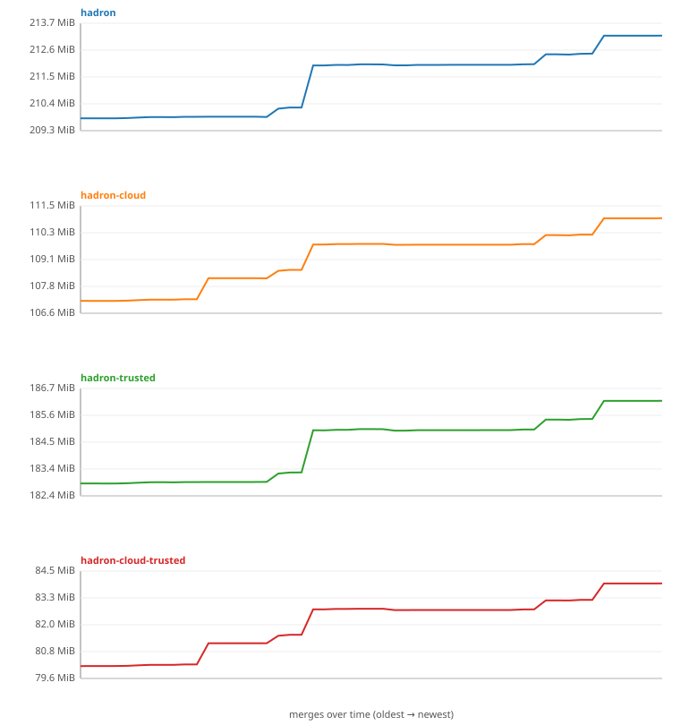

# 📦 Image size history

Uncompressed size (`docker image inspect .Size`, amd64) of each shipped
`:main` image, recorded once per merge. The CSV (`size-history.csv`) is the
source of truth; this page and the chart are regenerated from it by
`.github/scripts/size-history.sh`.

## Most recent 20 merges

| date | sha | hadron | hadron-cloud | hadron-trusted | hadron-cloud-trusted |
|---|---|--:|--:|--:|--:|
| 2026-07-25 | [`ab7c5a12e3ed`](https://github.com/kairos-io/hadron/commit/ab7c5a12e3ed9f07507336a432a7c737b562885f) | 213MB (-2.6KB) | 110MB (+236B) | 186MB (+633B) | 83MB (+185B) |
| 2026-07-24 | [`0f37336a7788`](https://github.com/kairos-io/hadron/commit/0f37336a77884747dc59380ff4aaf0a94df24f08) | 213MB (+22KB) | 110MB (+21KB) | 186MB (+22KB) | 83MB (+21KB) |
| 2026-07-21 | [`66b222796d14`](https://github.com/kairos-io/hadron/commit/66b222796d14e424f61319077af6a31f5a64a78c) | 213MB (+1.8KB) | 110MB (+49B) | 186MB (-3.0KB) | 83MB (-6B) |
| 2026-07-20 | [`2dc527eec060`](https://github.com/kairos-io/hadron/commit/2dc527eec060daa073c76186559ab9de3142054d) | 213MB (+1.8MB) | 110MB (+1.2MB) | 186MB (+1.8MB) | 83MB (+1.2MB) |
| 2026-07-19 | [`f6e9abe31308`](https://github.com/kairos-io/hadron/commit/f6e9abe31308ca6fd08efcfa0888d80abb6d6f08) | 211MB (-3.3KB) | 109MB (+425B) | 184MB (+5.0KB) | 82MB (+318B) |
| 2026-07-16 | [`4373dab25414`](https://github.com/kairos-io/hadron/commit/4373dab25414d176bfc477f7f1c79af7e2a5aa2b) | 211MB (+49KB) | 109MB (+44KB) | 184MB (+46KB) | 82MB (+44KB) |
| 2026-07-14 | [`2f4b50c49302`](https://github.com/kairos-io/hadron/commit/2f4b50c493029ab79825e84373dca7b0776a581d) | 211MB (+349KB) | 109MB (+350KB) | 184MB (+347KB) | 82MB (+350KB) |
| 2026-07-11 | [`533490d527f0`](https://github.com/kairos-io/hadron/commit/533490d527f06dc4ffc7afcef234134bc8d91cdb) | 210MB (-9.6KB) | 109MB (-7.8KB) | 183MB (+1.8KB) | 82MB (+155B) |
| 2026-07-09 | [`2193edcd4aba`](https://github.com/kairos-io/hadron/commit/2193edcd4aba9edf26ec4dddb12629a0a616c7db) [`v0.5.1`](https://github.com/kairos-io/hadron/releases/tag/v0.5.1) | 210MB (+0B) | 109MB (+0B) | 183MB (+0B) | 82MB (+0B) |
| 2026-07-09 | [`a059a4eccc51`](https://github.com/kairos-io/hadron/commit/a059a4eccc51586bcb67322156ebcc6ad2ee3825) | 210MB (+0B) | 109MB (+0B) | 183MB (+0B) | 82MB (+0B) |
| 2026-07-08 | [`15591032ddc1`](https://github.com/kairos-io/hadron/commit/15591032ddc1eb45a46025bd34273753c2062c81) | 210MB (+0B) | 109MB (+0B) | 183MB (+0B) | 82MB (+0B) |
| 2026-07-07 | [`9770f45f5a29`](https://github.com/kairos-io/hadron/commit/9770f45f5a29785412b9e1caef41b10d0a3eb5c9) [`v0.5.0`](https://github.com/kairos-io/hadron/releases/tag/v0.5.0) | 210MB (+0B) | 109MB (+0B) | 183MB (+0B) | 82MB (+0B) |
| 2026-07-07 | [`f1a66a3beb88`](https://github.com/kairos-io/hadron/commit/f1a66a3beb885d0b9d582c666d059ee36e8405db) | 210MB (+5.4KB) | 109MB (+977KB) | 183MB (+4.7KB) | 82MB (+977KB) |
| 2026-07-06 | [`2a1d0e7e8973`](https://github.com/kairos-io/hadron/commit/2a1d0e7e8973fe9b618ca56fcd82dffa98d46c57) | 210MB (+0B) | 108MB (+0B) | 183MB (+0B) | 81MB (+0B) |
| 2026-07-05 | [`b58fec5c6be2`](https://github.com/kairos-io/hadron/commit/b58fec5c6be250854e9ffc7ea02d8f7a7870948d) | 210MB (+13KB) | 108MB (+21KB) | 183MB (+12KB) | 81MB (+20KB) |
| 2026-07-01 | [`60a9683ca5e3`](https://github.com/kairos-io/hadron/commit/60a9683ca5e348527851eeaf6f2127022f0b7d1b) | 210MB (-3.3KB) | 108MB (+164B) | 183MB (-6.4KB) | 81MB (+700B) |
| 2026-06-29 | [`5046ffc48763`](https://github.com/kairos-io/hadron/commit/5046ffc487636ed74ef6cf651813d7fdb8301039) | 210MB (+0B) | 108MB (+0B) | 183MB (+1.8KB) | 81MB (+0B) |
| 2026-06-29 | [`42283828299d`](https://github.com/kairos-io/hadron/commit/42283828299dd9bbe5e9b5ff2a8beea02ad9dbe3) | 210MB (+19KB) | 108MB (+19KB) | 183MB (+21KB) | 81MB (+19KB) |
| 2026-06-28 | [`d48f407110c3`](https://github.com/kairos-io/hadron/commit/d48f407110c3194100dd4008b9d7e26073b74e34) | 210MB (+23KB) | 108MB (+26KB) | 183MB (+21KB) | 81MB (+26KB) |
| 2026-06-26 | [`ae12f001fb5c`](https://github.com/kairos-io/hadron/commit/ae12f001fb5cdd0e919a2078ad902a76a62ef5ef) | 210MB (+11KB) | 108MB (+12KB) | 183MB (+12KB) | 81MB (+12KB) |

